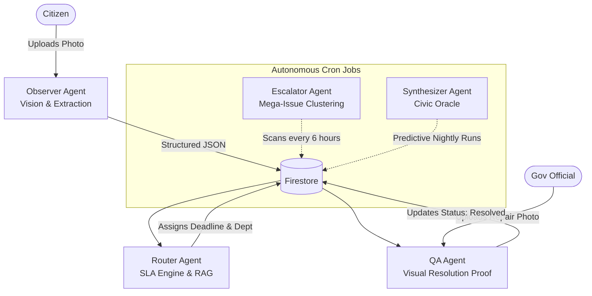

<div align="center">
  <h1>CivicLens.ai - Hyperlocal Problem Solver 🌍</h1>
  
  <p>
    
    
    
    
    
  </p>

  <p><strong>Vibe2Ship Hackathon Submission</strong></p>
</div>


CivicLens.ai is an intelligent, multi-agent platform that empowers citizens to report community issues while using AI to enforce government accountability, assign SLA deadlines, and verify issue resolution. 

---

## 🚀 Live Demo & Access

- **Frontend (Citizen App):** [https://civiclens-ca27d.web.app](https://civiclens-ca27d.web.app)
- **Backend (AI Engine):** [https://civiclens-api-249711436990.asia-south1.run.app](https://civiclens-api-249711436990.asia-south1.run.app)

**Demo Credentials:** *(Use this to bypass registration and explore immediately)*
- **Email:** demo@civiclens.ai
- **Password:** CivicLens2026

---

## 🎯 The Vision
Most civic reporting apps act as a "black hole" where complaints disappear. CivicLens fixes the broken loop between citizens and the government by introducing **AI-enforced accountability, crowdsourced verification, and gamified engagement.**

---

## 🧠 Multi-Agent AI Architecture

CivicLens operates as an autonomous shadow-government, powered entirely by 5 distinct Gemini agents acting in a decentralized orchestration network.



### The 5 Autonomous Agents:
1. **Observer Agent:** Utilizes True Function Calling to perform Computer Vision analysis on multi-modal image and video-based issue reporting. Automatically extracts severity (1-5) and translates multilingual text input (Hindi, Marathi, and regional languages) into English.
2. **Router Agent:** Utilizes RAG (Retrieval-Augmented Generation) to cross-reference synthetic municipal policy documents (`sla_document.md`), autonomously determining jurisdiction and assigning legally-binding SLA deadlines.
3. **Escalator Agent:** Autonomous cron-job agent running two passes every 6 hours: **(1) Geolocation Deduplication** using the Haversine formula to merge duplicate reports within 100 meters into a single Mega-Issue, and **(2) 3-Level SLA Escalation** generating legal documents (Formal Complaint → RTI Application Draft → Media/NGO Press Release) when SLA deadlines are breached.
4. **Synthesizer Agent (Civic Oracle):** Uses `gemini-3.5-flash` Pro to analyze city-wide data and generate a structured City Health Score, trending issue maps, investment priorities, and a journalistic weekly bulletin for government officials.
5. **QA Agent:** Acts as an impartial inspector by comparing "before" and "after" repair photos to prevent fraudulent ticket closures by contractors.

---

## ✨ Key Features & Visual Journey

### 1. Multi-Modal Vision & Report Submission
Citizens upload a photo of any civic hazard. The Observer Agent uses True Function Calling to classify the issue, score its severity (1–5), and tag hazard types in real-time.


Step 2 features an **interactive Google Maps with a draggable pin** — citizens click or drag to set the exact location, with automatic reverse geocoding filling the address field.


### 2. AI-Enforced SLAs (Service Level Agreements)
Instead of just classifying an issue, the Router Agent cross-references the municipal SLA policy document and assigns a **legally-binding deadline** (e.g., 24 hours for a severe water leak), routes it to the correct department, and auto-generates a formal complaint with the specific SLA rule cited.


### 3. Live Map View & Severity Heatmap
The public home feed toggles between a List view and a **live interactive Map view** powered by Google Maps. Each issue pin is colour-coded by AI-assigned severity: 🔴 Critical (5), 🟠 High (4), 🟡 Moderate (3), 🟢 Low (1–2). Switching to map view auto-triggers the Oracle Insights to overlay predicted future hotspots.


### 4. Public City Bulletin & Live SLA Escalation Strip
The home feed shows every citizen the **live City Health Score and weekly bulletin** generated by the Synthesizer Agent. Escalated issues (SLA breached) appear in a real-time **"🚨 SLA Escalations — Public Accountability"** strip, creating public pressure on authorities to respond.


### 5. Community Verification, Gamification & Real-Time Tracking
Citizens earn **Civic Points** for reporting and verifying issues, climbing a live leaderboard. A 5-tier badge system (Newcomer → City Guardian) rewards civic participation. Every status change is tracked via a live Firebase `onSnapshot` activity feed.


### 6. AI Quality Assurance (Resolution Proof)
Government officials cannot arbitrarily close tickets. They must upload a repair photo which the QA Agent compares against the original issue photo — mathematically proving the work was done and blocking fraudulent closures.


### 7. Authority Dashboard & Predictive Insights

**AI Action Queue:** Gemini reads all open issues and generates a prioritized action list ranked by severity and SLA urgency — telling officials exactly what to fix first.


**Kanban Board:** A real-time status board where authorities manage tickets across Reported → In Progress → Escalated → Resolved. Status changes are one-click and instantly reflected city-wide.


**Department Scorecard:** Mathematically grades each department on resolution rate (60%) and SLA compliance (40%), then uses Gemini to generate an AI commentary with a specific improvement recommendation.


**Civic Oracle — Predictive Insights:** Gemini analyzes all city-wide data and surfaces **Predicted Risks** (e.g., imminent water infrastructure failures), **Predicted Hotspots** per area (Mumbai Western Corridor, Bengaluru East, etc.), and **Strategic Advice** for government action — all AI-generated, not manually entered.


**Civic Oracle — Full City Health Report:** A structured, journalistic city infrastructure report with a City Health Score, trending issues, investment priorities, and a weekly bulletin for senior government officials.


---

## 🏗️ Technical Implementation

**Google Technologies Utilized:**
- **Google Gen AI SDK (Gemini):** Powered by `gemini-3.5-flash` for high-speed multi-modal vision and true function calling.
- **Custom AI Fallback Mesh:** A custom SDK wrapper that intercepts API errors and silently waterfalls through 4 Gemini model versions, ensuring 100% uptime with zero user-visible errors.
- **Google Cloud Run:** The entire Node.js AI backend is containerized with Docker and deployed for scalable, serverless execution.
- **Firebase:** Firebase Hosting, Auth, and Firestore (optimized with Base64 Image Storage).
- **Google Maps API:** High-accuracy geolocation pinning and Mega-Issue clustering.

---

## 💻 Local Setup Instructions

1. **Clone the repository:**
   ```bash
   git clone https://github.com/Aryan4283/civiclens-ai.git
   cd civiclens-ai
   ```

2. **Setup Frontend:**
   ```bash
   cd client
   npm install
   # Create a .env file with your Firebase and Google Maps keys
   npm run dev
   ```

3. **Setup Backend:**
   ```bash
   cd ../server
   npm install
   # Create a .env file with your GEMINI_API_KEY and Firebase Admin credentials
   npm run dev
   ```
